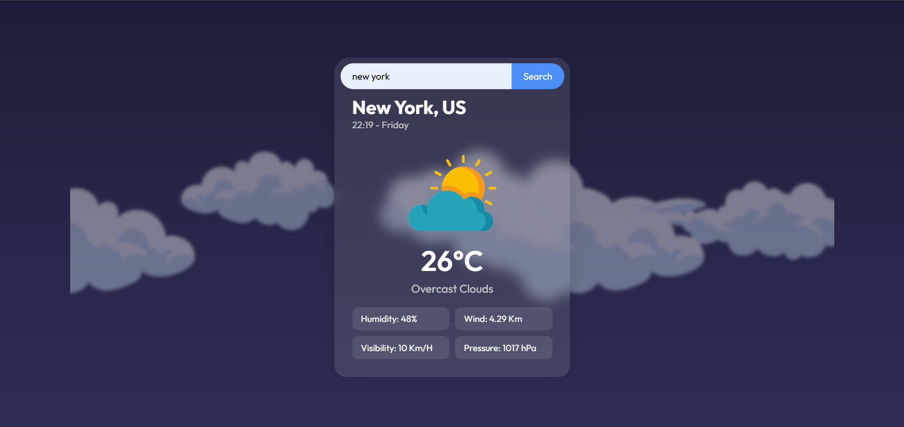
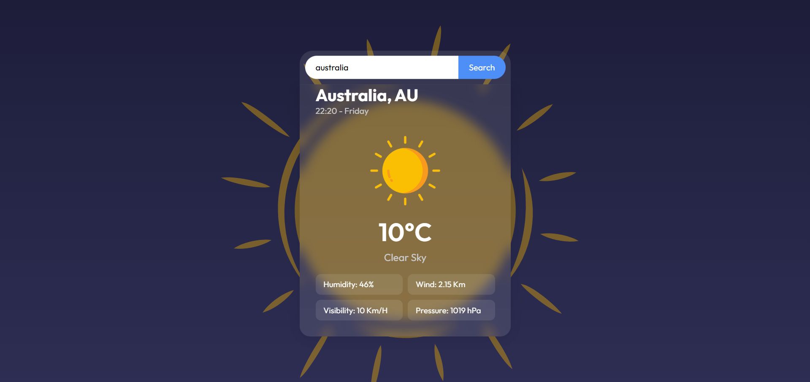

# 🌤️ Weather App

This project is a **Weather App** built using **HTML, CSS, and JavaScript**, which fetches real-time weather data from the **OpenWeatherMap API**. It provides users with detailed weather insights for any city they search.

## 📸 Screenshots




## 🚀 Features

- Real-time weather data fetching using OpenWeatherMap API
- Displays:
  - City and country name
  - Temperature
  - Weather description with dynamic weather icon
  - Humidity
  - Wind speed
  - Visibility
  - Pressure
- Error handling for invalid city input
- Animated card reveal for weather data and dynamic background

## 🛠️ Tech Stack

- HTML5
- CSS3 (Flexbox, Transitions, Animations)
- JavaScript (Fetch API, DOM manipulation)
- OpenWeatherMap API

## 🔧 Setup Instructions

1. Clone the repository:
   ```bash
   git clone https://github.com/DevForgeIndia/weather-app.git
   ```
2. Open `index.html` in your browser.
3. Replace the `apiKey` in `script.js` with your own [OpenWeatherMap API key](https://openweathermap.org/api).

## 📁 Project Structure

```
/weather-app
├── assets
|    ├── animations
|    └── icons
├── index.html
├── style.css
├── script.js
└── README.md
```

## 📜 License

This project is made for learning and academic purpose.

## 🙌 Acknowledgements

- [OpenWeatherMap](https://openweathermap.org/) for their free weather API.
- Inspired by clean UI principles and modern web development practices.

---

Made with ❤️ by [DevForge India](https://youtube.com/@DevForge-India)
